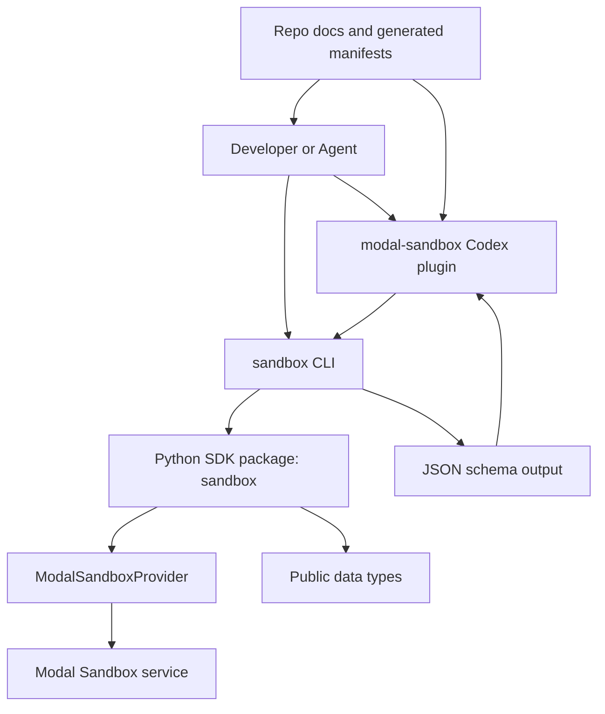
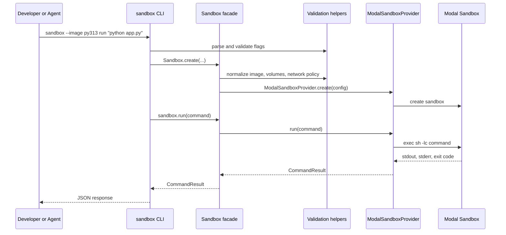
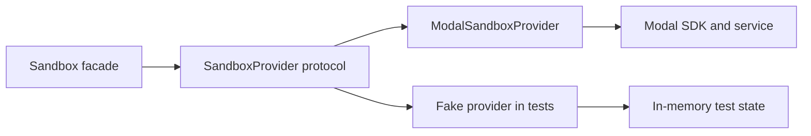
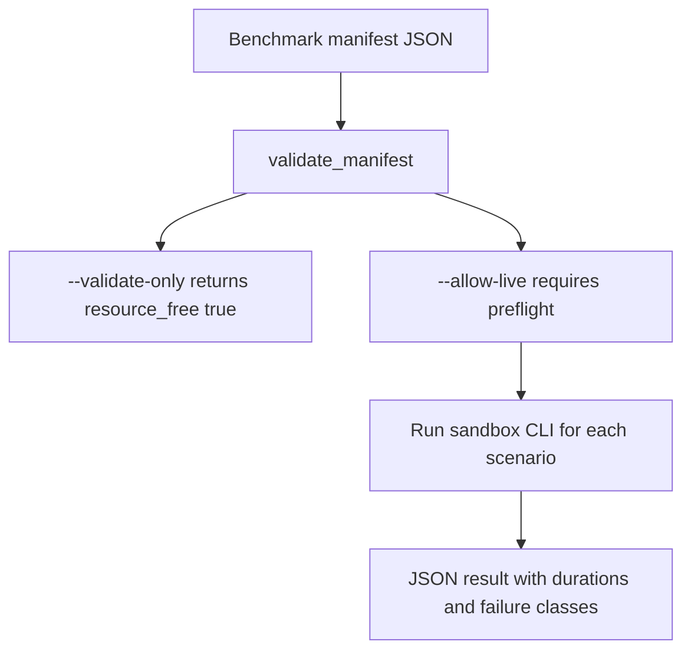
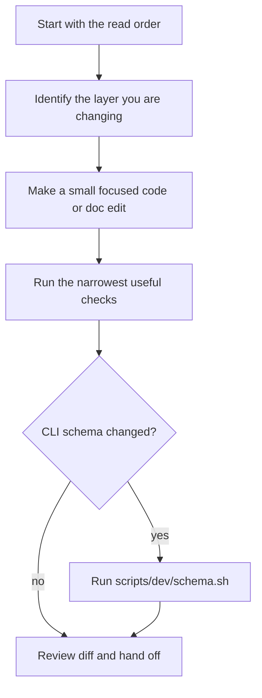

# How This Repo Works

This page is a beginner-friendly tour of the `modal-sandbox-sdk` repository.
It explains what the project is, how the pieces fit together, and where a new
developer should look first.

## The Big Idea

This repo provides a small Python SDK and JSON-first command-line interface for
working with Modal Sandboxes.

In plain language:

- A Modal Sandbox is a remote, isolated environment where commands can run.
- The Python SDK gives developers a friendly `Sandbox` object.
- The CLI exposes the same workflows through the `sandbox` command.
- The Codex plugin wraps the CLI so agents can use sandboxes safely.
- The docs and generated schemas teach humans and agents what is safe to run.

The project is intentionally narrow. It is not trying to replace Modal's full
SDK, and it is not a generic sandbox platform. Its job is to make common Modal
Sandbox workflows predictable, scriptable, and safe for agents.

## System Map



Read this diagram from top to bottom:

1. A person or agent starts with either the plugin, CLI, or Python SDK.
2. The plugin does not duplicate sandbox logic. It delegates to the installed
   `sandbox` CLI.
3. The CLI delegates real work to the Python SDK.
4. The SDK delegates Modal-specific operations to `ModalSandboxProvider`.
5. The provider is the only layer that talks directly to Modal.
6. Generated schema and docs explain the contract so humans and agents do not
   need to infer behavior from code.

## Repository Layout

```text
.
|-- packages/
|   |-- sandbox/              # Public Python SDK
|   `-- sandbox_cli/          # JSON-first CLI entrypoint
|-- plugins/
|   `-- modal-sandbox/        # Codex plugin, skill, portable scripts
|-- docs/
|   |-- references/           # Durable how-to and onboarding docs
|   |-- design-docs/          # Design principles and maintainability notes
|   |-- generated/            # Generated CLI schema and agent manifest
|   `-- exec-plans/           # Long-running initiative state
|-- tests/                    # Unit, packaging, plugin, and opt-in live tests
|-- examples/                 # Small runnable examples
`-- scripts/                  # Dev, release, schema, and plan validation helpers
```

The most important rule: the package code lives under `packages/`, the plugin
lives under `plugins/modal-sandbox/`, and the repo knowledge system lives under
`docs/`.

## What Each Layer Owns

| Layer | Main files | What it owns |
| --- | --- | --- |
| Public SDK | `packages/sandbox/sandbox.py` | The developer-facing `Sandbox` workflow API |
| Modal provider | `packages/sandbox/provider_modal.py` | Translation between SDK calls and Modal APIs |
| Public types | `packages/sandbox/types.py`, `commands.py`, `files.py`, `volumes.py` | JSON-friendly dataclasses and helper objects |
| Validation | `packages/sandbox/_validation.py` | Normalizing and rejecting invalid user input before provider calls |
| CLI | `packages/sandbox_cli/cli.py` | Argument parsing, JSON output, lifecycle rules, schema metadata |
| Plugin | `plugins/modal-sandbox/skills/modal-sandbox/SKILL.md` | Agent workflow instructions and live-action boundaries |
| Plugin scripts | `plugins/modal-sandbox/scripts/` | Portable preflight and benchmark orchestration around the installed CLI |
| Tests | `tests/` | Fake-provider tests by default, opt-in live Modal tests |
| Docs | `docs/` | Source-of-truth architecture, product intent, workflows, and plans |

## Request Flow: Running A Command



The CLI prints JSON so scripts and agents can read the result reliably. A
nonzero command inside the sandbox is still a completed command result. It is
represented as `exit_code` in JSON rather than automatically becoming a Python
exception.

## The SDK Facade

The `Sandbox` class in `packages/sandbox/sandbox.py` is the friendly API.

Think of it as the front desk:

- It receives a user request like "create a sandbox" or "write this file".
- It normalizes public options into a `SandboxConfig`.
- It validates combinations that should never reach Modal.
- It delegates side effects to a provider.

Example:

```python
from sandbox import Sandbox

sandbox = Sandbox.create(runtime="python3.13")
result = sandbox.run("python -c 'print(123)'")
print(result.stdout)
sandbox.close()
```

Important methods:

- `Sandbox.create(...)`: create a new sandbox or attach by ID.
- `Sandbox.from_id(...)`: attach to an existing sandbox by object ID.
- `Sandbox.from_name(...)`: attach to a running named sandbox.
- `Sandbox.get_or_create(...)`: reuse a named sandbox or create it if absent.
- `run(...)`: run a shell command.
- `run_command(...)`: run argv-style commands without shell wrapping.
- `write_text`, `read_text`, `copy_from_local`, `copy_to_local`: file helpers.
- `seed_git`, `seed_tarball`: pull public source into the sandbox.
- `snapshot`, `sync_workspace`, `snapshot_filesystem`: persistence helpers.

## The Provider Boundary

`packages/sandbox/provider_modal.py` contains the Modal-specific implementation.
This is where the SDK crosses from "our small public API" into "Modal API
calls".

Why this boundary matters:

- Tests can use fake providers without creating Modal resources.
- Modal can be imported lazily, so importing `sandbox` stays lightweight.
- Provider errors can be translated into SDK-specific exception types.
- Path handling stays consistent between CLI and SDK calls.



The provider owns details such as:

- Creating and attaching to Modal sandboxes.
- Running shell and argv commands.
- Reading and writing files through Modal's filesystem API.
- Resolving Modal volumes and images.
- Translating Modal auth, permission, timeout, and not-found errors.
- Converting Modal metadata into SDK dataclasses.

## Public Data Types

The small dataclasses are deliberately boring. That is good.

They make results JSON-friendly and easy to test:

- `CommandResult`: stdout, stderr, exit code, duration, timeout, truncation.
- `SandboxCommand`: handle for detached commands.
- `SandboxFile`: path, content, optional file mode for bulk writes.
- `SandboxVolume`: Modal volume plus mount path.
- `SandboxConfig`: normalized sandbox configuration.
- `SandboxSnapshot`: volume-backed workspace checkpoint metadata.
- `SandboxImageSnapshot`: Modal image-backed snapshot metadata.
- `SandboxFileStat`: file metadata.
- `SandboxWatchEvent`: bounded filesystem watch event metadata.
- `SandboxReadinessProbe`: TCP or exec readiness probe.

## Path Rules

This repo is careful about paths because local files and sandbox files are not
the same thing.

| Input path | Meaning |
| --- | --- |
| `app.py` | Resolve inside the sandbox workspace, usually `/workspace/app.py` |
| `src/app.py` | Resolve inside the sandbox workspace, usually `/workspace/src/app.py` |
| `/tmp/app.py` | Use absolute path inside the sandbox |
| `../secret.txt` | Reject because it tries to escape the workspace |

Beginner mental model:

The sandbox workspace is like a project folder inside the remote sandbox.
Relative paths stay inside that folder. Local filesystem access only happens
through explicit upload and download helpers.

## CLI Design

The CLI lives in `packages/sandbox_cli/cli.py`.

Its job is not just to call the SDK. It also defines the public command
contract:

- Parse arguments.
- Reject invalid lifecycle combinations before creating resources.
- Print JSON for normal output.
- Print JSON errors for failures.
- Expose a machine-readable schema through `sandbox schema`.
- Keep dry discovery commands resource-free.

Safe discovery commands:

```bash
uv run sandbox dry
uv run sandbox schema
uv run sandbox doctor
uv run sandbox quickstart
```

Live commands create or attach to Modal resources:

```bash
uv run sandbox --image py313 quickstart --run
uv run sandbox --image py313 run "python -c 'print(123)'"
uv run sandbox --image py313 start
```

The CLI schema is a big deal in this repo. It allows agents to inspect command
behavior before acting. When CLI metadata changes, regenerate and review:

```bash
./scripts/dev/schema.sh
```

Generated files:

- `docs/generated/cli-schema.json`
- `docs/generated/agent-manifest.json`

## Plugin Design

The plugin under `plugins/modal-sandbox/` is the product front door for Codex
agents.

The plugin skill teaches agents:

- Run safe discovery before live work.
- Do not install or upgrade the CLI silently.
- Do not create Modal resources unless the user asked for live execution.
- Prefer JSON output over prose guessing.
- Treat user-supplied commands as untrusted.
- Keep live benchmark runs explicitly authorized.

The plugin delegates to the installed `sandbox` command. It does not ship a
separate implementation of sandbox execution, and it does not replace the SDK.

## Plugin Scripts

Portable scripts live in `plugins/modal-sandbox/scripts/`.

They are intentionally standard-library-only because they are distributed with
the plugin and should run outside this repo.

Important scripts:

- `preflight.py`: resource-free checks around the installed CLI.
- `benchmark.py`: validates benchmark manifests without resources, then runs
  bounded live comparisons only with `--allow-live`.

Benchmark flow:



Important beginner note:

Designing or validating a benchmark is not the same as running it. Live Modal
benchmark execution requires `--allow-live`, and preflight must report that
credentials are authenticated.

## Volumes And Persistence

By default, a sandbox is temporary. If you want files to survive separate CLI
calls, use a Modal volume.

```bash
uv run sandbox --image py313 --workspace-volume work write app.py --content "print(123)"
uv run sandbox --image py313 --workspace-volume work run "python app.py"
uv run sandbox --image py313 --workspace-volume work read app.py
uv run sandbox --image py313 --workspace-volume work sync
```

Mental model:

- A sandbox is the remote computer.
- The workspace is the project folder in that computer.
- A workspace volume is the persistent disk mounted at that project folder.
- `sync` asks the remote environment to flush workspace volume changes.
- `snapshot` reports volume checkpoint metadata.

```mermaid
flowchart LR
    CLI[sandbox command] --> Sandbox[Modal Sandbox]
    Sandbox --> Workspace[/workspace]
    Workspace --> Volume[Modal Volume]
    Volume --> Later[Later CLI call]
```

## Tests

Default tests must not create real Modal resources. This is one of the most
important safety rules in the repo.

Common test groups:

- `tests/test_sandbox.py`: SDK facade behavior with fake providers.
- `tests/test_provider_modal.py`: provider translation using fake Modal-like
  objects.
- `tests/test_cli.py`: parser behavior, JSON output, lifecycle rules.
- `tests/test_plugin_scripts.py`: portable plugin script behavior.
- `tests/test_plugin_distribution.py`: packaging and distribution contracts.
- `tests/test_modal_live.py`: opt-in live Modal coverage.

Useful commands:

```bash
uv run pytest tests/test_cli.py
uv run pytest tests/test_sandbox.py tests/test_provider_modal.py
./scripts/dev/check.sh
```

Live Modal tests are opt-in:

```bash
MODAL_SANDBOX_SDK_RUN_MODAL_TESTS=1 ./scripts/dev/live-smoke.sh
```

## Documentation System

The docs are part of the product, not an afterthought.

Read order for new agents and contributors:

1. `AGENTS.md`
2. `ARCHITECTURE.md`
3. `docs/PRODUCT_SENSE.md`
4. `docs/references/cli.md`
5. `docs/exec-plans/index.md`

Important docs:

- `docs/PRODUCT_SENSE.md`: who this is for and what the project optimizes for.
- `docs/references/cli.md`: stable command workflows.
- `docs/references/development.md`: local validation and release checks.
- `docs/design-docs/core-beliefs.md`: principles like small, Modal-first, JSON-first.
- `docs/design-docs/cognitive-load.md`: maintainability rules.
- `docs/generated/agent-manifest.json`: compact machine-readable orientation.

## Execution Plans

Long-running work uses Harness-style execution plans under `docs/exec-plans/`.

An active plan has:

- A narrative `PLAN_<initiative>.md`.
- `state/feature-list.json` for implementation checklist state.
- `state/session-state.json` for handoff state.
- `state/progress.jsonl` for progress entries.

Validate plan state with:

```bash
./scripts/execplan/check.sh
```

Do not create random task folders or markdown task files for active work unless
a human explicitly asks. This repo keeps long-running state in a structured
place so agents and humans can pick up the thread safely.

## How To Make A Change Safely



Practical examples:

- If you change SDK behavior, update or add tests in `tests/test_sandbox.py`.
- If you change Modal provider translation, update `tests/test_provider_modal.py`.
- If you change CLI flags or output, update `packages/sandbox_cli/cli.py`,
  `docs/references/cli.md`, generated schema, and CLI tests together.
- If you change plugin behavior, review `plugins/modal-sandbox/skills/modal-sandbox/SKILL.md`.
- If you change distributed plugin scripts, keep them standard-library-only.

## Common Beginner Questions

### Why are there both SDK and CLI layers?

The SDK is for Python developers. The CLI is for shell users and coding agents.
They share the same underlying behavior, but the CLI adds JSON output and a
machine-readable schema.

### Why does the plugin call the CLI instead of importing the SDK?

The installed CLI is the stable execution engine. Calling it keeps the plugin
portable and makes behavior visible through JSON.

### Why is Modal imported lazily?

Importing `sandbox` should stay lightweight. Users should be able to inspect
types, docs, and CLI metadata without immediately needing Modal credentials or
heavy provider setup.

### Why are nonzero command exits not exceptions?

A command exiting `7` inside the sandbox is a real result, not necessarily an
SDK failure. The result belongs in `CommandResult.exit_code`. Transport,
authentication, permission, and configuration failures are different.

### Why do dry commands matter so much?

Agents need a safe way to inspect capabilities before creating resources.
Commands like `sandbox dry`, `sandbox schema`, `sandbox doctor`, and
`sandbox quickstart` are designed to teach the workflow without contacting
Modal resources.

### What should I read first as a new developer?

Start with:

1. `ARCHITECTURE.md`
2. `docs/PRODUCT_SENSE.md`
3. `docs/references/cli.md`
4. `packages/sandbox/sandbox.py`
5. `packages/sandbox/provider_modal.py`
6. `packages/sandbox_cli/cli.py`
7. The tests for the area you want to change

## Glossary

| Term | Meaning |
| --- | --- |
| Sandbox | A remote isolated Modal execution environment |
| Workspace | The default project directory inside the sandbox, usually `/workspace` |
| Volume | A Modal-backed persistent storage mount |
| Facade | A friendly public API that hides lower-level provider details |
| Provider | The backend implementation that talks to Modal |
| Dry command | A command that inspects readiness or schema without creating Modal resources |
| Live command | A command that creates, attaches to, or contacts Modal resources |
| JSON contract | The machine-readable output shape the CLI promises |
| Agent manifest | Compact generated JSON that tells agents how to use the repo safely |
| Execution plan | Structured long-running initiative state under `docs/exec-plans/` |

## Final Mental Model

The repo is shaped like a set of nested promises:

1. The plugin promises agents safe workflows.
2. The CLI promises JSON contracts and explicit lifecycle behavior.
3. The SDK promises a small Python API.
4. The provider promises Modal-specific translation.
5. The tests promise default validation without creating real Modal resources.
6. The docs promise that humans and agents can understand the system without
   reverse-engineering every file.

When in doubt, keep changes small, preserve the JSON-first contract, and run
the narrowest useful no-resource validation before broad checks.
